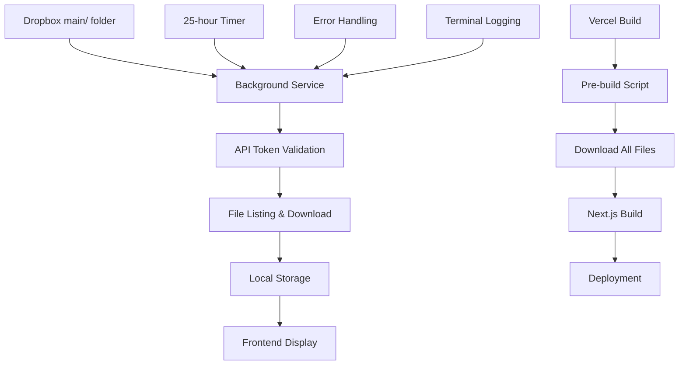

# 🚀 CRYPTO CLUB 69 - Professional Crypto News Platform

<div align="center">


**Professional cryptocurrency news platform with automated content management and real-time market data**

[🚀 Live Demo](https://your-demo-url.com) • [📖 Documentation](#documentation) • [🤝 Contributing](#contributing)

</div>

---

## ✨ Features

### 🎯 **Core Features**
- 🏠 **Modern Homepage** - Retro-futuristic design with rotating slides
- 📰 **News Management** - 9 comprehensive news articles with HTML content
- 🖼️ **Image Gallery** - 54+ high-quality images from automated Dropbox sync
- 📊 **Real-time Data** - Live cryptocurrency price ticker and market overview
- 📱 **Responsive Design** - Perfect on all devices (mobile, tablet, desktop)
- ⚡ **Fast Performance** - Optimized with Next.js 14 and App Router

### 🔧 **Advanced Backend Features**
- 🤖 **Fully Automated Backend Service** - Runs independently without frontend
- 🔄 **Smart Auto-sync** - Downloads files every 25 hours automatically
- 🏗️ **Build Integration** - Vercel deployment with pre-build file downloads
- 🔒 **Secure API Management** - Environment-based token security
- 📁 **File Management** - Automatic organization of 54+ images and HTML files
- ⚙️ **Background Processing** - Terminal logging and error handling
- 🎯 **Content Automation** - Zero manual intervention required
- 🎨 **Glassmorphism UI** - Modern glass-like design effects
- 📈 **Interactive Charts** - Volume analysis and market data visualization

### 🎨 **UI/UX Features**
- 🌟 **Retro-futuristic Theme** - Cyberpunk-inspired design
- 🎭 **Smooth Animations** - Hover effects and transitions
- 🎪 **Interactive Elements** - Clickable news cards with modals
- 🎯 **Category System** - 9 crypto categories (Bitcoin, Ethereum, DeFi, etc.)
- 🔍 **Modal System** - Full HTML content display for news articles

---

## 🛠️ Tech Stack

| Category | Technology |
|----------|------------|
| **Framework** | Next.js 14 with App Router |
| **Language** | TypeScript 5 |
| **Styling** | Tailwind CSS 3 |
| **Icons** | Lucide React |
| **API Integration** | Dropbox API |
| **Deployment** | Vercel |
| **Environment** | dotenv |

---

## 🚀 Quick Start

### Prerequisites
- Node.js 18+ 
- npm or yarn
- Dropbox account (for content management)

### Installation

1. **Clone the repository:**
   ```bash
   git clone https://github.com/ARJUNCHOUDHARY69/demos-hackathon-n8n-crytpoclub69.git
   cd demos-hackathon-n8n-crytpoclub69
   ```

2. **Install dependencies:**
   ```bash
   npm install
   ```

3. **Set up environment variables:**
   ```bash
   cp .env.example .env.local
   ```
   
   Add your Dropbox access token:
   ```env
   DROPBOX_ACCESS_TOKEN=your_dropbox_token_here
   ```

4. **Run the development server:**
   ```bash
   npm run dev
   ```

5. **Open your browser:**
   Navigate to [http://localhost:3000](http://localhost:3000)

### Production Build

```bash
npm run build
npm start
```

---

## 📁 Project Structure

```
crypto-club-69/
├── 📁 app/
│   ├── 📁 api/
│   │   ├── 📁 crypto/          # Crypto API endpoints
│   │   ├── 📁 dropbox-auto/    # Dropbox automation
│   │   └── 📁 news/            # News content API
│   ├── 📁 news/                # News page
│   ├── 📁 article/             # Article page
│   ├── 📄 globals.css          # Global styles & animations
│   ├── 📄 layout.tsx           # Root layout
│   └── 📄 page.tsx             # Homepage
├── 📁 components/
│   ├── 📄 Header.tsx           # Navigation header
│   ├── 📄 Hero.tsx             # Hero section
│   ├── 📄 NewsGrid.tsx         # News articles grid
│   ├── 📄 TrendingSection.tsx  # Trending crypto
│   ├── 📄 PriceTicker.tsx      # Live price ticker
│   ├── 📄 MarketOverview.tsx   # Market statistics
│   ├── 📄 VolumeChart.tsx      # Volume analysis
│   ├── 📄 ActivityWidget.tsx   # Activity metrics
│   └── 📄 Footer.tsx           # Footer
├── 📁 lib/
│   ├── 📄 dropbox-service.ts   # Dropbox API service
│   ├── 📄 scheduler.ts         # Automation scheduler
│   ├── 📄 config.ts            # Configuration
│   └── 📄 startup.ts           # Service initialization
├── 📁 scripts/
│   └── 📄 download-all-files.js # Build-time file download
├── 📁 public/
│   └── 📁 dropbox-downloads/   # Auto-synced content
├── 📄 dropbox-service.js       # Standalone service
├── 📄 vercel.json              # Vercel configuration
└── 📄 package.json
```

---

## 🎯 Key Features Explained

### 🤖 **Automated Backend System**
- **🔄 Fully Automated Service**: Runs independently as a background Node.js service
- **📁 Dropbox Integration**: Automatically syncs content from Dropbox `main/` folder
- **⏰ Smart Scheduling**: Downloads new files every 25 hours automatically
- **🏗️ Build Integration**: Downloads all files during Vercel deployment process
- **📊 Terminal Logging**: Real-time status updates and error handling
- **🔒 Secure Token Management**: Environment-based API key security
- **📱 Zero Manual Intervention**: Completely hands-off content management
- **🎯 File Organization**: Automatic categorization of 54+ images and HTML files
- **⚡ Performance Optimized**: Efficient file handling and caching

### 📰 **News System**
- **9 News Articles**: Comprehensive crypto news coverage
- **Modal Display**: Click to view full HTML content
- **Image Galleries**: 5 images per article for visual appeal
- **Category System**: Organized by crypto topics
- **Responsive Cards**: Beautiful hover effects and animations

### 📊 **Market Data**
- **Live Ticker**: Real-time cryptocurrency prices
- **Market Overview**: Global market statistics
- **Volume Charts**: Trading volume analysis
- **Activity Widget**: Live market activity metrics

### 🎨 **Design System**
- **Retro-futuristic**: Cyberpunk-inspired aesthetic
- **Glassmorphism**: Modern glass-like effects
- **Smooth Animations**: Hover effects and transitions
- **Responsive**: Mobile-first design approach

---

## 🏗️ Backend Architecture

### 🤖 **Automation Flow**



### 🔧 **Backend Components**

| Component | Purpose | Technology |
|-----------|---------|------------|
| **dropbox-service.js** | Standalone automation service | Node.js |
| **lib/dropbox-service.ts** | Core API integration | TypeScript |
| **lib/scheduler.ts** | 25-hour automation timer | Node.js |
| **scripts/download-all-files.js** | Build-time file download | Node.js |
| **lib/background-service.ts** | Service orchestration | TypeScript |

### ⚙️ **How It Works**

1. **🔄 Background Service**: Runs independently every 25 hours
2. **📁 File Discovery**: Scans Dropbox `main/` folder for new content
3. **⬇️ Smart Download**: Downloads only new/changed files
4. **📊 Real-time Logging**: Terminal output with progress tracking
5. **🏗️ Build Integration**: Downloads all files during Vercel deployment
6. **🎯 Content Delivery**: Frontend displays automatically updated content

### 🚀 **Backend Commands**

```bash
# Start the background service
npm run dropbox

# Manual file download (build process)
npm run build

# Vercel-specific build
npm run vercel-build
```

---

## 🔧 Configuration

### Environment Variables

Create a `.env.local` file:

```env
# Dropbox API Configuration
DROPBOX_ACCESS_TOKEN=your_dropbox_access_token_here

# Optional: Customize intervals (in milliseconds)
DOWNLOAD_INTERVAL=90000000  # 25 hours
CLEANUP_INTERVAL=90000000   # 25 hours
MAX_FILE_AGE_HOURS=25       # 25 hours
```

### Dropbox Setup

1. Create a Dropbox app at [Dropbox App Console](https://www.dropbox.com/developers/apps)
2. Generate an access token
3. Create a folder named `main/` in your Dropbox
4. Upload your content (images, HTML files) to the `main/` folder
5. Add the access token to your `.env.local` file

### 🤖 **Backend Service in Action**

The backend service runs automatically and provides detailed logging:

```bash
🚀 Dropbox Background Service Started
📅 Next download scheduled in 25 hours
🔍 Scanning Dropbox main/ folder...
📋 Found 54 files in main/ folder
📦 Downloading new files...
⬇️ [1/54] Downloading: photo1.jpg (1533594 bytes)
✅ [1/54] Downloaded: photo1.jpg (1533594 bytes)
⬇️ [2/54] Downloading: photo2.jpg (1518386 bytes)
✅ [2/54] Downloaded: photo2.jpg (1518386 bytes)
...
🎉 All files downloaded successfully!
⏰ Next scheduled download: 25 hours
```

### 🔧 **Service Management**

```bash
# Check service status
npm run dropbox

# View logs
tail -f logs/dropbox-service.log

# Manual trigger (for testing)
curl -X POST http://localhost:3000/api/dropbox-auto
```

---

## 🚀 Deployment

### Vercel (Recommended)

1. **Connect your repository to Vercel**
2. **Add environment variables:**
   - `DROPBOX_ACCESS_TOKEN`: Your Dropbox access token
3. **Deploy**: Vercel will automatically run the build process

The build process will:
- Download all files from Dropbox during build
- Compile the Next.js application
- Deploy with all content included

### Other Platforms

This project can be deployed to any platform supporting Next.js:
- **Netlify**
- **AWS Amplify**
- **Railway**
- **DigitalOcean App Platform**

---

## 📱 Screenshots

<div align="center">

### Homepage


### News Page


### Mobile View


</div>

---

## 🤝 Contributing

We welcome contributions! Here's how you can help:

1. **Fork the repository**
2. **Create a feature branch:**
   ```bash
   git checkout -b feature/amazing-feature
   ```
3. **Make your changes**
4. **Test thoroughly**
5. **Commit your changes:**
   ```bash
   git commit -m 'Add amazing feature'
   ```
6. **Push to the branch:**
   ```bash
   git push origin feature/amazing-feature
   ```
7. **Open a Pull Request**

### Development Guidelines

- Follow TypeScript best practices
- Use Tailwind CSS for styling
- Maintain responsive design
- Test on multiple devices
- Update documentation as needed

---

## 📄 License

This project is licensed under the MIT License - see the [LICENSE](LICENSE) file for details.

---

## 🆘 Support

- 📧 **Email**: ARJUN.CHOUDHARY00070@GMAIL.COM

---

## 🙏 Acknowledgments

- **Next.js Team** - For the amazing framework
- **Tailwind CSS** - For the utility-first CSS framework
- **Dropbox API** - For seamless file management
- **Vercel** - For excellent deployment platform
- **Crypto Community** - For inspiration and feedback

---

<div align="center">

**🚀 CRYPTO CLUB 69 - Your ultimate destination for cryptocurrency news and market insights! 🚀**

Made with ❤️ for the crypto community

[⬆ Back to Top](#-crypto-club-69---professional-crypto-news-platform)

</div>