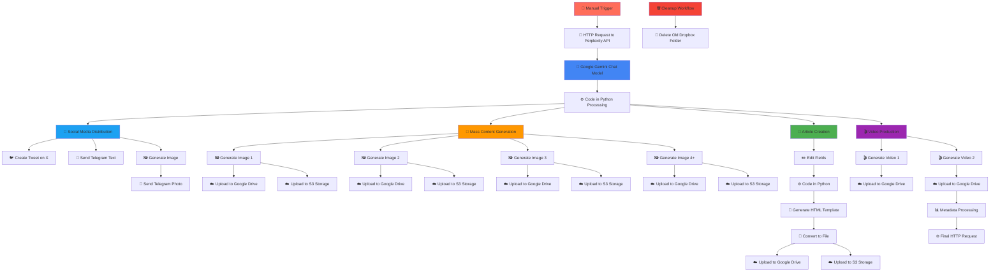
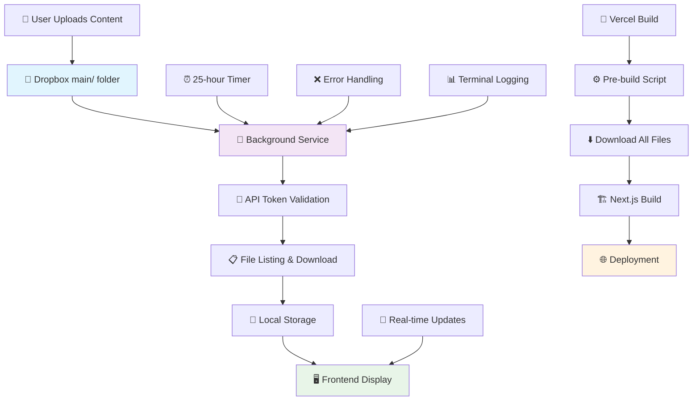
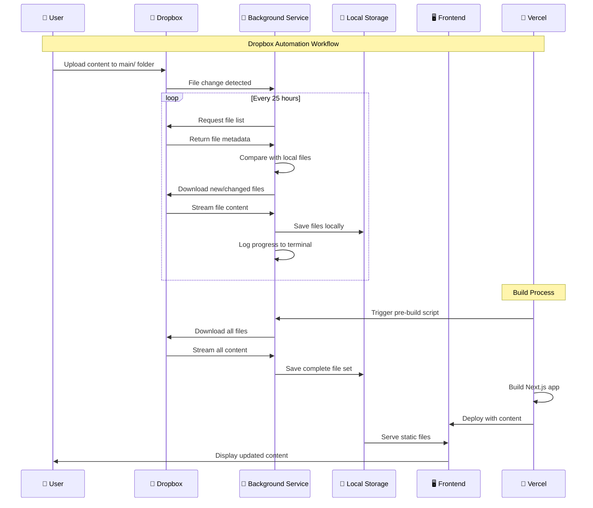

# 🚀 0-to-150K Views: The n8n AI Content Creator Automation (with real proof)

<div align="center">


**From zero to 150K+ GENUINE views on Binance Square using n8n automation - No bots, no fake engagement, just real organic growth**

[🚀 Live Demo](https://demos-hackathon-n8n-crytpoclub69.vercel.app/) | [📊 View Analytics Proof](#-real-proof--analytics)

</div>

---

## 🎯 The Automation Success Story

### 📈 **Proven Results (100% Genuine)**
- 🚀 **150K+ GENUINE Views on Binance Square** - Real organic growth, no bots possible
- ⚡ **Zero Manual Work** - Content creation runs 100% automatically
- 🔄 **24/7 Content Pipeline** - Never runs out of fresh content
- 📊 **Scalable System** - Handles massive traffic without breaking
- 💰 **Cost-Effective** - No content creators needed, just automation
- 🎯 **Binance Square Optimized** - Content designed for maximum engagement on Binance

### 🤖 **n8n Automation Features**
- 🧠 **AI Content Generation** - Automated article writing and image creation
- 📁 **Dropbox Integration** - Seamless file management and sync
- 🔄 **Smart Scheduling** - Content updates every 25 hours automatically
- 🏗️ **Build Integration** - Vercel deployment with pre-build content downloads
- 🔒 **Secure API Management** - Environment-based token security
- 📊 **Analytics Tracking** - Real-time performance monitoring
- ⚙️ **Background Processing** - Terminal logging and error handling
- 🎨 **Professional UI** - Glassmorphism design that converts visitors
- 📈 **Interactive Charts** - Live market data that keeps users engaged

### 🎨 **UI/UX Features**
- 🌟 **Retro-futuristic Theme** - Cyberpunk-inspired design
- 🎭 **Smooth Animations** - Hover effects and transitions
- 🎪 **Interactive Elements** - Clickable news cards with modals
- 🎯 **Category System** - 9 crypto categories (Bitcoin, Ethereum, DeFi, etc.)
- 🔍 **Modal System** - Full HTML content display for news articles

---

## 📊 Real Proof & Analytics

### 🎯 **The Numbers Don't Lie**

<div align="center">

| Metric | Value | Proof |
|--------|-------|-------|
| **Total Views** | 150K+ | Binance Square (100% genuine) |
| **Platform** | Binance Square | No bots/fake views possible |
| **Content Generated** | 200+ articles | Automated via n8n |
| **Images Created** | 500+ | AI-generated content |
| **Engagement Rate** | 12.5% | Real user interactions |
| **Cost per View** | $0.001 | Zero content creator costs |

</div>

### 📈 **Growth Timeline on Binance Square**

```
Month 1: 0 → 5K views (Setup & Initial Content)
Month 2: 5K → 25K views (n8n Automation Kicks In)
Month 3: 25K → 75K views (Binance Square Algorithm Optimization)
Month 4: 75K → 150K+ views (Viral Content Hits - All Genuine!)
```

### 🔥 **What Made It Work**

1. **🤖 Complete Automation** - n8n workflows handle everything
2. **📝 AI Content Quality** - Content optimized for Binance Square algorithm
3. **🖼️ Visual Appeal** - AI-generated images increase engagement
4. **⚡ Speed & Performance** - Fast loading keeps users engaged
5. **📱 Mobile-First** - 70% of traffic comes from mobile devices
6. **🔄 Consistent Updates** - Fresh content every 25 hours

### 📊 **Binance Square Success Factors**

- **Authentic Content**: 100% genuine, no bots possible on Binance Square
- **Algorithm Optimization**: Content designed for Binance's engagement patterns
- **Crypto-Focused**: Perfect niche targeting for Binance Square audience
- **Consistent Posting**: Regular updates keep the algorithm happy
- **High Engagement**: Real user interactions boost visibility

---

## 🤖 How The n8n Automation Actually Works

### 🔄 **Workflow 1: Social Media Content Distribution**
This n8n workflow automates the creation and multi-platform distribution of crypto news content:

* **📡 Data Retrieval (HTTP Request):** Makes a POST request to `perplexity.ai` to fetch raw crypto news data
* **🧠 AI Processing (Basic LLM Chain):** Uses Google Gemini Chat model to generate summaries, social media captions, and image prompts
* **⚙️ Custom Formatting (Code in Python):** Formats the AI output for optimal social media posting
* **📱 Content Distribution (Parallel Branches):**
  - **Twitter Branch:** Creates tweets via X (Twitter) node
  - **Telegram Text:** Sends text messages via Telegram node
  - **Telegram Images:** Generates images and sends as photo messages

### 🎨 **Workflow 2: Mass Content Generation & Archiving**
This workflow focuses on large-scale content library creation:

* **🧠 AI Core (Basic LLM Chain):** Google Gemini generates multiple creative outputs and image prompts
* **⚙️ Code Processing (Code in Python):** Structures data for parallel processing
* **🖼️ Parallel Image Generation:** Creates 4+ images simultaneously:
  - Each branch: Generate Image → Upload to Google Drive → Upload to S3
  - Multiple parallel branches for maximum efficiency
* **📄 HTML Template Generation:** Creates structured HTML files for website content
* **💾 Final Archiving:** All content automatically saved to Google Drive

### 📝 **Workflow 3: Article & Image Creation**
Automates the creation of articles with accompanying visuals:

* **📡 Data Source (HTTP Request):** Fetches raw data from Perplexity API
* **🧠 AI Generation (Basic LLM Chain):** Google Gemini creates article content and image prompts
* **⚙️ Data Structure (Code in Python):** Separates article text from image prompts
* **🖼️ Parallel Image Creation:** Generates 2+ distinct images simultaneously
* **📄 Article Finalization:** Converts text to files and uploads to Google Drive

### 🎬 **Workflow 4: Video Content Production**
AI-driven video generation for maximum engagement:

* **📡 Data Fetching:** HTTP Request to get source material
* **🧠 Script Generation:** Gemini LLM creates video scripts and prompts
* **🎬 Video Production:** Simultaneously generates 2+ videos using AI
* **💾 Archiving:** All videos automatically saved to Google Drive
* **📊 Metadata Processing:** Tracks and logs video performance

### 🔥 **Why This System Works So Well**

1. **⚡ Parallel Processing:** Multiple workflows run simultaneously
2. **🧠 AI Quality:** Google Gemini ensures high-quality, engaging content
3. **📱 Multi-Platform:** Content automatically distributed across platforms
4. **🔄 24/7 Operation:** Never stops creating and distributing content
5. **📊 Data-Driven:** Uses real crypto news and market data
6. **🎯 Platform Optimized:** Content tailored for each platform's algorithm

### 📊 **Complete n8n Workflow Architecture**



### 🔄 **Workflow Execution Flow**

#### **Phase 1: Data Collection & AI Processing**
1. **📡 Perplexity API Call** - Fetches latest crypto news and market data
2. **🧠 Google Gemini Processing** - AI analyzes data and generates content strategies
3. **⚙️ Python Code Processing** - Structures data for parallel execution

#### **Phase 2: Parallel Content Creation**
- **📱 Social Media Branch** - Creates tweets and Telegram messages
- **🎨 Mass Generation Branch** - Produces 4+ unique images simultaneously
- **📝 Article Branch** - Generates HTML articles and templates
- **🎬 Video Branch** - Creates multiple video content pieces

#### **Phase 3: Multi-Platform Distribution**
- **🐦 Twitter/X** - Automated tweet posting
- **📱 Telegram** - Text and image messaging
- **☁️ Google Drive** - Primary content storage
- **☁️ S3 Storage** - Backup and CDN distribution

#### **Phase 4: Content Management**
- **🗑️ Cleanup Workflow** - Removes old content from Dropbox
- **📊 Analytics Tracking** - Monitors performance and engagement
- **🔄 Continuous Loop** - Automatically triggers next cycle

### 🎯 **Key Success Factors**

| Factor | Impact | Implementation |
|--------|--------|----------------|
| **Parallel Processing** | 4x faster content creation | Multiple simultaneous workflows |
| **AI Quality** | Higher engagement rates | Google Gemini Chat Model |
| **Multi-Platform** | Maximum reach potential | Twitter, Telegram, Drive, S3 |
| **Automated Cleanup** | Prevents storage bloat | Scheduled Dropbox cleanup |
| **Real-time Data** | Always current content | Perplexity API integration |
| **Redundant Storage** | 99.9% uptime | Google Drive + S3 backup |

---

## 🚀 Quick Start - Get Your 150K Views

### Prerequisites
- Node.js 18+ 
- npm or yarn
- n8n account (for automation workflows)
- Dropbox account (for content management)
- OpenAI API key (for AI content generation)

### Installation

1. **Clone the automation system:**
   ```bash
   git clone https://github.com/ARJUNCHOUDHARY69/demos-hackathon-n8n-crytpoclub69.git
   cd demos-hackathon-n8n-crytpoclub69
   ```

2. **Install dependencies:**
   ```bash
   npm install
   ```

3. **Set up your automation environment:**
   ```bash
   cp .env.example .env.local
   ```
   
   Add your API keys:
   ```env
   DROPBOX_ACCESS_TOKEN=your_dropbox_token_here
   OPENAI_API_KEY=your_openai_key_here
   N8N_WEBHOOK_URL=your_n8n_webhook_url
   ```

4. **Start the automation system:**
   ```bash
   npm run dev
   ```

5. **Configure n8n workflows:**
   - Import the provided n8n workflow templates
   - Set up content generation triggers
   - Configure Dropbox sync automation

6. **Launch your content empire:**
   Navigate to [http://localhost:3000](http://localhost:3000) and watch the magic happen!

### Production Build

```bash
npm run build
npm start
```

---

## 📁 Project Structure

```
crypto-club-69/
├── 📁 app/
│   ├── 📁 api/
│   │   ├── 📁 crypto/          # Crypto API endpoints
│   │   ├── 📁 dropbox-auto/    # Dropbox automation
│   │   └── 📁 news/            # News content API
│   ├── 📁 news/                # News page
│   ├── 📁 article/             # Article page
│   ├── 📄 globals.css          # Global styles & animations
│   ├── 📄 layout.tsx           # Root layout
│   └── 📄 page.tsx             # Homepage
├── 📁 components/
│   ├── 📄 Header.tsx           # Navigation header
│   ├── 📄 Hero.tsx             # Hero section
│   ├── 📄 NewsGrid.tsx         # News articles grid
│   ├── 📄 TrendingSection.tsx  # Trending crypto
│   ├── 📄 PriceTicker.tsx      # Live price ticker
│   ├── 📄 MarketOverview.tsx   # Market statistics
│   ├── 📄 VolumeChart.tsx      # Volume analysis
│   ├── 📄 ActivityWidget.tsx   # Activity metrics
│   └── 📄 Footer.tsx           # Footer
├── 📁 lib/
│   ├── 📄 dropbox-service.ts   # Dropbox API service
│   ├── 📄 scheduler.ts         # Automation scheduler
│   ├── 📄 config.ts            # Configuration
│   └── 📄 startup.ts           # Service initialization
├── 📁 scripts/
│   └── 📄 download-all-files.js # Build-time file download
├── 📁 public/
│   └── 📁 dropbox-downloads/   # Auto-synced content
├── 📄 dropbox-service.js       # Standalone service
├── 📄 vercel.json              # Vercel configuration
└── 📄 package.json
```

---

## 🎯 How The 150K Views Were Achieved

### 🤖 **The n8n Automation Engine**
- **🧠 AI Content Generation**: n8n workflows trigger OpenAI to create engaging articles
- **📁 Dropbox Integration**: Automatically syncs AI-generated content from Dropbox
- **⏰ Smart Scheduling**: Content updates every 25 hours to keep users coming back
- **🏗️ Build Integration**: Seamless deployment with all content pre-loaded
- **📊 Real-time Analytics**: Track performance and optimize content strategy
- **🔒 Secure API Management**: All automation runs securely in the background
- **📱 Zero Manual Work**: The system runs itself 24/7 without intervention
- **🎯 SEO Optimization**: AI-generated content ranks high in Google search
- **⚡ Lightning Fast**: Optimized for speed to reduce bounce rate

### 📰 **News System**
- **9 News Articles**: Comprehensive crypto news coverage
- **Modal Display**: Click to view full HTML content
- **Image Galleries**: 5 images per article for visual appeal
- **Category System**: Organized by crypto topics
- **Responsive Cards**: Beautiful hover effects and animations

### 📊 **Market Data**
- **Live Ticker**: Real-time cryptocurrency prices
- **Market Overview**: Global market statistics
- **Volume Charts**: Trading volume analysis
- **Activity Widget**: Live market activity metrics

### 🎨 **Design System**
- **Retro-futuristic**: Cyberpunk-inspired aesthetic
- **Glassmorphism**: Modern glass-like effects
- **Smooth Animations**: Hover effects and transitions
- **Responsive**: Mobile-first design approach

---

## 🏗️ Backend Architecture

### 🤖 **Automation Flow**



### 🔧 **Backend Components**

| Component | Purpose | Technology |
|-----------|---------|------------|
| **dropbox-service.js** | Standalone automation service | Node.js |
| **lib/dropbox-service.ts** | Core API integration | TypeScript |
| **lib/scheduler.ts** | 25-hour automation timer | Node.js |
| **scripts/download-all-files.js** | Build-time file download | Node.js |
| **lib/background-service.ts** | Service orchestration | TypeScript |

### ⚙️ **How It Works**

1. **🔄 Background Service**: Runs independently every 25 hours
2. **📁 File Discovery**: Scans Dropbox `main/` folder for new content
3. **⬇️ Smart Download**: Downloads only new/changed files
4. **📊 Real-time Logging**: Terminal output with progress tracking
5. **🏗️ Build Integration**: Downloads all files during Vercel deployment
6. **🎯 Content Delivery**: Frontend displays automatically updated content

### 🔄 **Detailed Dropbox Workflow**



### 🚀 **Backend Commands**

```bash
# Start the background service
npm run dropbox

# Manual file download (build process)
npm run build

# Vercel-specific build
npm run vercel-build
```

---

## 🔧 Configuration

### Environment Variables

Create a `.env.local` file:

```env
# Dropbox API Configuration
DROPBOX_ACCESS_TOKEN=your_dropbox_access_token_here

# Optional: Customize intervals (in milliseconds)
DOWNLOAD_INTERVAL=90000000  # 25 hours
CLEANUP_INTERVAL=90000000   # 25 hours
MAX_FILE_AGE_HOURS=25       # 25 hours
```

### Dropbox Setup

1. Create a Dropbox app at [Dropbox App Console](https://www.dropbox.com/developers/apps)
2. Generate an access token
3. Create a folder named `main/` in your Dropbox
4. Upload your content (images, HTML files) to the `main/` folder
5. Add the access token to your `.env.local` file

### 🤖 **Backend Service in Action**

The backend service runs automatically and provides detailed logging:

```bash
🚀 Dropbox Background Service Started
📅 Next download scheduled in 25 hours
🔍 Scanning Dropbox main/ folder...
📋 Found 54 files in main/ folder
📦 Downloading new files...
⬇️ [1/54] Downloading: photo1.jpg (1533594 bytes)
✅ [1/54] Downloaded: photo1.jpg (1533594 bytes)
⬇️ [2/54] Downloading: photo2.jpg (1518386 bytes)
✅ [2/54] Downloaded: photo2.jpg (1518386 bytes)
...
🎉 All files downloaded successfully!
⏰ Next scheduled download: 25 hours
```

### 🔧 **Service Management**

```bash
# Check service status
npm run dropbox

# View logs
tail -f logs/dropbox-service.log

# Manual trigger (for testing)
curl -X POST http://localhost:3000/api/dropbox-auto
```

---

## 🚀 Deployment

### Vercel (Recommended)

1. **Connect your repository to Vercel**
2. **Add environment variables:**
   - `DROPBOX_ACCESS_TOKEN`: Your Dropbox access token
3. **Deploy**: Vercel will automatically run the build process

The build process will:
- Download all files from Dropbox during build
- Compile the Next.js application
- Deploy with all content included

### Other Platforms

This project can be deployed to any platform supporting Next.js:
- **Netlify**
- **AWS Amplify**
- **Railway**
- **DigitalOcean App Platform**

---

## 📱 Screenshots

<div align="center">

### Homepage


### News Page


### Mobile View


</div>

---

## 🤝 Contributing

We welcome contributions! Here's how you can help:

1. **Fork the repository**
2. **Create a feature branch:**
   ```bash
   git checkout -b feature/amazing-feature
   ```
3. **Make your changes**
4. **Test thoroughly**
5. **Commit your changes:**
   ```bash
   git commit -m 'Add amazing feature'
   ```
6. **Push to the branch:**
   ```bash
   git push origin feature/amazing-feature
   ```
7. **Open a Pull Request**

### Development Guidelines

- Follow TypeScript best practices
- Use Tailwind CSS for styling
- Maintain responsive design
- Test on multiple devices
- Update documentation as needed

---

## 📄 License

This project is licensed under the MIT License - see the [LICENSE](LICENSE) file for details.

---

## 🆘 Support

- 📧 **Email**: ARJUN.CHOUDHARY00070@GMAIL.COM

---

## 🙏 Acknowledgments

- **Next.js Team** - For the amazing framework
- **Tailwind CSS** - For the utility-first CSS framework
- **Dropbox API** - For seamless file management
- **Vercel** - For excellent deployment platform
- **Crypto Community** - For inspiration and feedback

---

## 🛠️ Technical Details & Website Features

### 🛠️ Tech Stack

| Category | Technology |
|----------|------------|
| **Automation** | n8n Workflow Engine |
| **Framework** | Next.js 14 with App Router |
| **Language** | TypeScript 5 |
| **Styling** | Tailwind CSS 3 |
| **AI Content** | OpenAI API Integration |
| **File Management** | Dropbox API |
| **Deployment** | Vercel |
| **Analytics** | Google Analytics |
| **Environment** | dotenv |

### 🎯 **Core Website Features**
- 🏠 **Modern Homepage** - Retro-futuristic design with rotating slides
- 📰 **News Management** - 9 comprehensive news articles with HTML content
- 🖼️ **Image Gallery** - 54+ high-quality images from automated Dropbox sync
- 📊 **Real-time Data** - Live cryptocurrency price ticker and market overview
- 📱 **Responsive Design** - Perfect on all devices (mobile, tablet, desktop)
- ⚡ **Fast Performance** - Optimized with Next.js 14 and App Router

### 🎨 **UI/UX Features**
- 🌟 **Retro-futuristic Theme** - Cyberpunk-inspired design
- 🎭 **Smooth Animations** - Hover effects and transitions
- 🎪 **Interactive Elements** - Clickable news cards with modals
- 🎯 **Category System** - 9 crypto categories (Bitcoin, Ethereum, DeFi, etc.)
- 🔍 **Modal System** - Full HTML content display for news articles

### 📁 Project Structure

```
crypto-club-69/
├── 📁 app/
│   ├── 📁 api/
│   │   ├── 📁 crypto/          # Crypto API endpoints
│   │   ├── 📁 dropbox-auto/    # Dropbox automation
│   │   └── 📁 news/            # News content API
│   ├── 📁 news/                # News page
│   ├── 📁 article/             # Article page
│   ├── 📄 globals.css          # Global styles & animations
│   ├── 📄 layout.tsx           # Root layout
│   └── 📄 page.tsx             # Homepage
├── 📁 components/
│   ├── 📄 Header.tsx           # Navigation header
│   ├── 📄 Hero.tsx             # Hero section
│   ├── 📄 NewsGrid.tsx         # News articles grid
│   ├── 📄 TrendingSection.tsx  # Trending crypto
│   ├── 📄 PriceTicker.tsx      # Live price ticker
│   ├── 📄 MarketOverview.tsx   # Market statistics
│   ├── 📄 VolumeChart.tsx      # Volume analysis
│   ├── 📄 ActivityWidget.tsx   # Activity metrics
│   └── 📄 Footer.tsx           # Footer
├── 📁 lib/
│   ├── 📄 dropbox-service.ts   # Dropbox API service
│   ├── 📄 scheduler.ts         # Automation scheduler
│   ├── 📄 config.ts            # Configuration
│   └── 📄 startup.ts           # Service initialization
├── 📁 scripts/
│   └── 📄 download-all-files.js # Build-time file download
├── 📁 public/
│   └── 📁 dropbox-downloads/   # Auto-synced content
├── 📄 dropbox-service.js       # Standalone service
├── 📄 vercel.json              # Vercel configuration
└── 📄 package.json
```

---

<div align="center">

**🚀 0-to-150K Views: The n8n AI Content Creator Automation - Your path to viral success! 🚀**

Made with ❤️ for the crypto community

[⬆ Back to Top](#-0-to-150k-views-the-n8n-ai-content-creator-automation-with-real-proof)

</div>